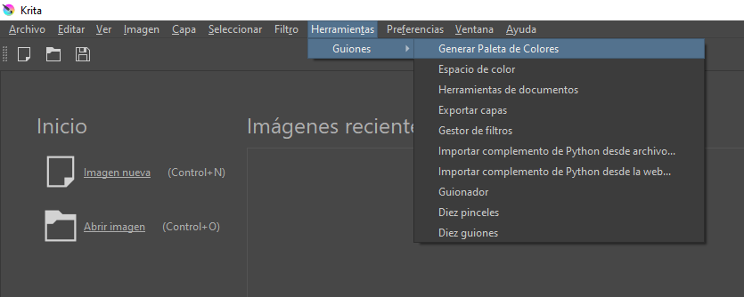
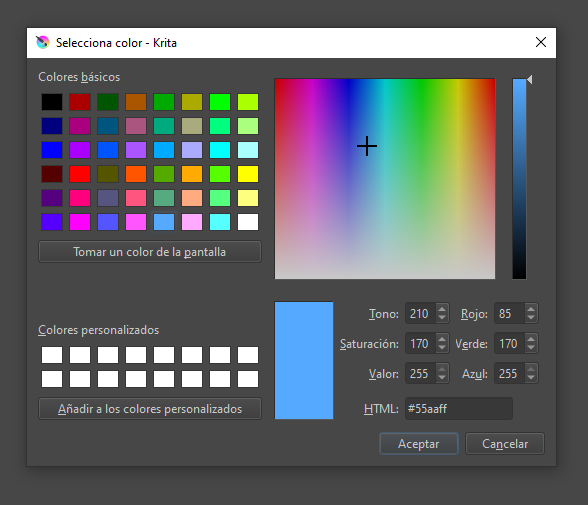
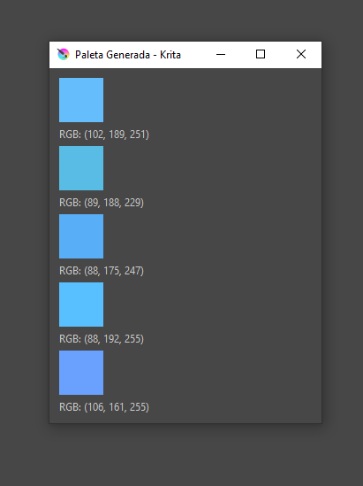

# Generador de Paleta de colores
Plugin para krita que genera una paleta de colores a partir de un color seleccionado. Desarrollado por Gabo99x(Flores Gabriel) y MartinMigue(Rios Martin)
## Instalacion del plugin dentro de krita
1)Copie el archivo GeneradorPaleta.desktop y la carpeta GeneradorPaleta en C:\Users\usuario\AppData\Roaming\krita\pykrita  
2)Abra el programa preferencias->configurar Krita -> Gestor de complementos de Python y selecionelo  
3)Reinicie Krita
## Pasos para utilizar el plugin
Busque el plugin en Herramientas->Guiones->Generar Paleta de colores

 
Seleccione el color para crear su paleta de color
 

 
Se abre una ventana con la paleta de colores generada
 

